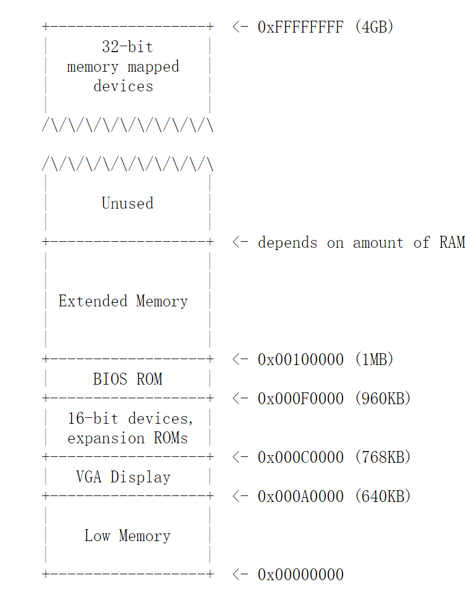
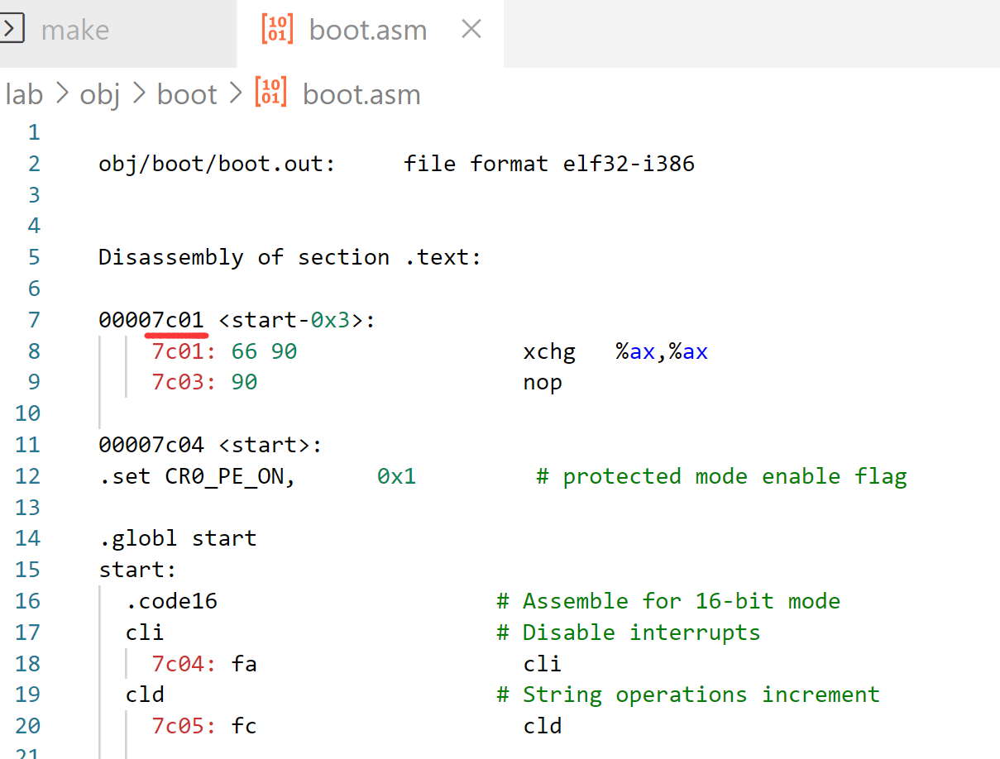
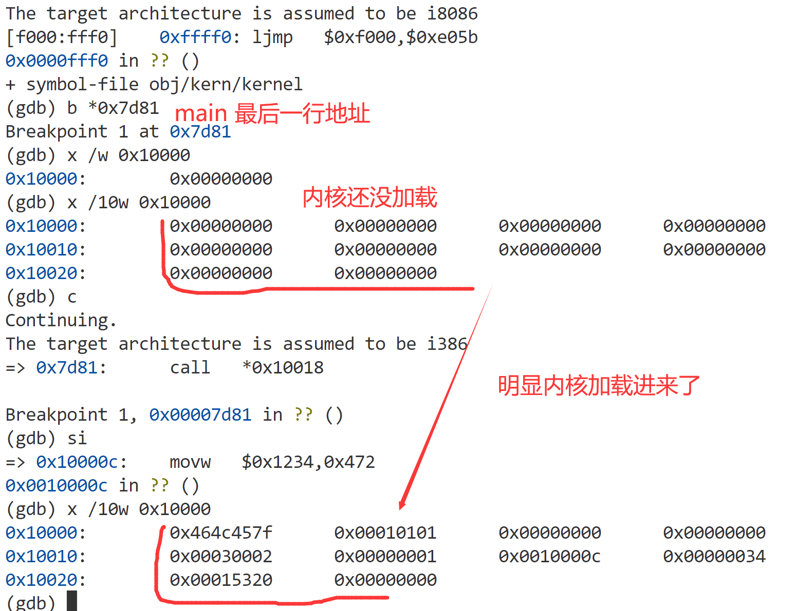
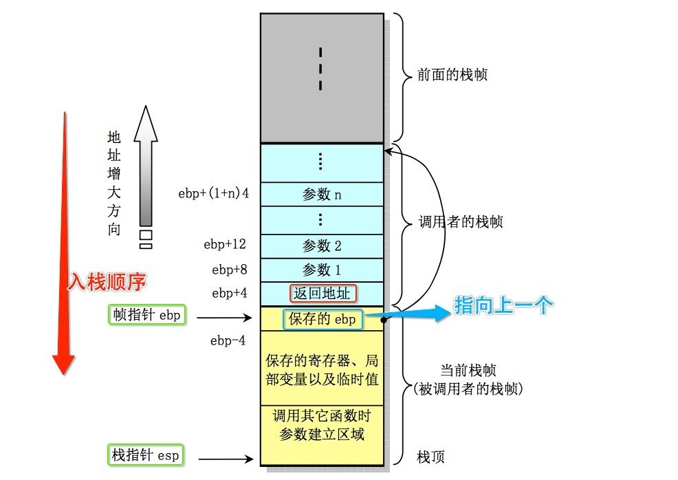

# 6.828 Lab 1: Booting a PC


<!--more-->

[Lab 1: PC Bootstrap and GCC Calling Conventions ](https://pdos.csail.mit.edu/6.828/2018/labs/lab1/)


## 0 Introduction

实验分成三部分。第一部分集中于熟悉X86汇编语言、 QEMU x86仿真器和 PC 的开机引导程序。第二部分检查6.828内核的引导加载程序，它位于lab的`boot` 目录中。最后，第三部分将深入研究6.828内核本身的初始模板--- JOS，位于内核目录中。

### Software Setup

环境：推荐使用 docker搭建Ubuntu18.04 或 20.04 


linux环境搭建：[docker 搭建纯净版Linux](https://www.jianshu.com/p/46cb844273ca)   小问题：缺少git安装（apt install git）、实验环境没有与本地挂载，但影响不大

```shell
mkdir ~/6.828
cd ~/6.828
git clone https://pdos.csail.mit.edu/6.828/2018/jos.git lab
git clone https://github.com/mit-pdos/6.828-qemu.git qemu
cd lab
```

qemu环境配置参考： [MIT6.828/install.md](https://github.com/woai3c/MIT6.828/blob/master/docs/install.md)


## Part 1: PC Bootstrap

介绍x86汇编语言和PC引导程序（PC Bootstrap），并开始使用QEMU和QEMU/GDB调试

### 1.1 Getting Started with x86 assembly

建议在继续lab2之前，熟悉一下x86汇编。


[Inline Assembly with DJGPP](http://www.delorie.com/djgpp/doc/brennan/brennan_att_inline_djgpp.html)，实验参考资料；

[80386 Programmer's Reference Manual](https://pdos.csail.mit.edu/6.828/2018/readings/i386/toc.htm)，80386手册后续实验需参考；



王爽 8086汇编语言，环境只需要一个 [EMU8086模拟器即可](https://emu8086-microprocessor-emulator.en.softonic.com/)，初学耗时2 ~ 7days，无需前置知识

CSAPP第三章 & [bomblab](http://csapp.cs.cmu.edu/3e/labs.html)，初学耗时7days+，做完此lab后对x86汇编和gdb会有很深的理解；



---

### 1.2 Simulating the x86


按照实验指导操作就行，简单地 `make` `make qemu-gdb` `make gdb`，推出qemu先按ctrl + a，再按x

----

### 1.3 1.4 The PC's Physical Address Space & The ROM BIOS 

<div align=center><p>
    Address Space
    </p></div>


现代处理器都会向下兼容之前的处理器，如80386 32bit 兼容8086/8088 16bit处理器，所以前1MB低地址还是与16bit 的内容一样；



BIOS的操作就是在控制，初始化，检测各种底层的设备，比如时钟，GDTR寄存器，以及设置中断向量表。作为PC启动后运行的第一段程序，	它最重要的功能是把操作系统从磁盘中导入内存，然后再把控制权转交给操作系统。所以BIOS在运行的最后会去检测可以从当前系统的哪个设备中找到操作系统，通常来说是我们的磁盘。也有可能是U盘等等。当BIOS确定了，操作系统位于磁盘中，那么它就会把这个磁盘的第一个扇区，通常把它叫做启动区（boot sector）先加载到内存中，这个启动区中包括一个非常重要的程序--boot loader，它会负责完成整个操作系统从磁盘导入内存的工作，以及一些其他的非常重要的配置工作。最后操作系统才会开始运行。

[详细gdb过程可参考该博客](https://www.cnblogs.com/fatsheep9146/p/5078179.html)



可参考[bootloader总结](#jump-bootloader)


---

## Part 2: The Boot Loader

[boot.S & main.c 做了什么可参考该博客 3. The Boot Loader](https://www.cnblogs.com/JayL-zxl/p/14908346.html)



***TODO***

看完程序员的自我修养后来补充




#### Exercise 4.


考察对C指针的掌握程度，如果没有C编译器的话，可下个[Dev-C++ for Windows  ](https://sourceforge.net/projects/embarcadero-devcpp/)简单的跑一下程序

```c
#include <stdio.h>
#include <stdlib.h>
void
f(void)
{
    int a[4];
    int *b = malloc(16);
    int *c;
    int i;

    printf("1: a = %p, b = %p, c = %p\n", a, b, c);

    c = a;
    for (i = 0; i < 4; i++)
	a[i] = 100 + i;
    c[0] = 200;
    printf("2: a[0] = %d, a[1] = %d, a[2] = %d, a[3] = %d\n",
	   a[0], a[1], a[2], a[3]);

    c[1] = 300;
    *(c + 2) = 301;
    3[c] = 302;
    printf("3: a[0] = %d, a[1] = %d, a[2] = %d, a[3] = %d\n",
	   a[0], a[1], a[2], a[3]);

    c = c + 1;
    *c = 400;
    printf("4: a[0] = %d, a[1] = %d, a[2] = %d, a[3] = %d\n",
	   a[0], a[1], a[2], a[3]);

    c = (int *) ((char *) c + 1);
    *c = 500;
    printf("5: a[0] = %d, a[1] = %d, a[2] = %d, a[3] = %d\n",
	   a[0], a[1], a[2], a[3]);

    b = (int *) a + 1;
    c = (int *) ((char *) a + 1);
    printf("6: a = %p, b = %p, c = %p\n", a, b, c);
}

int
main(int ac, char **av)
{
    f();
    return 0;
}
```

结果是否想象的一样呢，当然这里的地址是不同的

```
a = 000000000062FDC0, b = 0000000000C61400, c = 0000000000000001
a[0] = 200, a[1] = 101, a[2] = 102, a[3] = 103
a[0] = 200, a[1] = 300, a[2] = 301, a[3] = 302
a[0] = 200, a[1] = 400, a[2] = 301, a[3] = 302
a[0] = 200, a[1] = 128144, a[2] = 256, a[3] = 302
a = 000000000062FDC0, b = 000000000062FDC4, c = 000000000062FDC1
```

---

#### Exercise 5.


将`boot/Makefrag`中BIOS 将引导扇区的链接地址改为0x7C01，执行`make clean` `make` 

```
$(OBJDIR)/boot/boot: $(BOOT_OBJS)
	@echo + ld boot/boot
	$(V)$(LD) $(LDFLAGS) -N -e start -Ttext 0x7C01 -o $@.out $^
	$(V)$(OBJDUMP) -S $@.out >$@.asm
	$(V)$(OBJCOPY) -S -O binary -j .text $@.out $@
	$(V)perl boot/sign.pl $(OBJDIR)/boot/boot
```

重新编译后BIOS把bootloader 链接到内存地址 也改为了0x7C01；

<div align=center></div>

然后重启gdb 一下，b *0x7c00，一直si，程序就会崩溃，just try it...


#### Exercise 6.

<div align=center></div>


## Part 3: The Kernel

#### **Exercise 7.** 


注释掉`mov %eax,%cr0` ，b *0x100025：

```
(gdb) x/8x 0x00100000
0x100000:	0x1badb002	0x00000000	0xe4524ffe	0x7205c766
0x100010:	0x34000004	0x7000b812	0x220f0011	0xc0200fd8
(gdb) x/8x 0xf0100000
0xf0100000 <_start-268435468>:	0x00000000	0x00000000	0x00000000	0x00000000
0xf0100010 <entry+4>:	0x00000000	0x00000000	0x00000000	0x00000000
```

执行完这条指令之后：

```markdown
(gdb) x/8x 0x00100000
0x100000:	0x1badb002	0x00000000	0xe4524ffe	0x7205c766
0x100010:	0x34000004	0x7000b812	0x220f0011	0xc0200fd8
(gdb) x/8x 0xf0100000
0xf0100000 <_start-268435468>:	0x1badb002	0x00000000	0xe4524ffe	0x7205c766
0xf0100010 <entry+4>:	0x34000004	0x7000b812	0x220f0011	0xc0200fd8
```

可以发现，在执行这条指令之前，0xf0100000处是全0的，在执行之后，有了和0x00100000处一样的值。	是因为设置了控制寄存器CR0的某些项

在entry.S中

```assembly
	# Turn on paging.
	movl	%cr0, %eax
	orl	$(CR0_PE|CR0_PG|CR0_WP), %eax
	movl	%eax, %cr0
```

这段汇编就是将%cr0 寄存器设置为CR0_PE|CR0_PG|CR0_WP；开启分页后，mmu硬件通过cr3找到页目录地址才有用；

```
// Control Register flags
#define CR0_PE		0x00000001	// Protection Enable
#define CR0_MP		0x00000002	// Monitor coProcessor
#define CR0_EM		0x00000004	// Emulation
#define CR0_TS		0x00000008	// Task Switched
#define CR0_ET		0x00000010	// Extension Type
#define CR0_NE		0x00000020	// Numeric Errror
#define CR0_WP		0x00010000	// Write Protect
#define CR0_AM		0x00040000	// Alignment Mask
#define CR0_NW		0x20000000	// Not Writethrough
#define CR0_CD		0x40000000	// Cache Disable
#define CR0_PG		0x80000000	// Paging
```

在entry.S中可以看到，之后他尝试执行的指令是：

```
mov	$relocated, %eax
jmp	*%eax
```

他要在执行C代码之前，跳转到KERNBASE上方，不再在低地址了。从gdb可以发现，这里移入`%eax`的值为0xf010002f，如果没有启用分页，那么跳转将会失败。

可以发现当注释掉那一行之后，会导致内核崩溃，卡在`Booting from Hard Disk..`，同时利用GDB查看也可以看到，跳转进入的0xf010002c位置为全0。

[CR0寄存器是什么](https://blog.csdn.net/ZZHinclude/article/details/117897975)


#### Exercise8

在 `printfmt.c` 中，参考一下上下文代码，修改一下

```
		case 'o':
			// Replace this with your code.
			// putch('X', putdat);
			// putch('X', putdat);
			// putch('X', putdat);
			// break;
			num = getuint(&ap, lflag);
			base = 8;
			goto number;
```

修改完之后重新`make`就能显示"6828 decimal is 15254 octal!"

问题解答参考 [exercise 8](https://123xzy.github.io/2019/03/14/MIT-6-828-Lab-Booting-a-PC/) ，最重要的一个问题是参数压栈是从右往左压栈的，这样函数调用后使用栈中元素从下往上，就能模拟函数参数从左往右的顺序

### The Stack

函数调用时栈做的事情，理解这个图很重要，可参考csapp中文版 p164。

<div align=center></div>

#### Exercise 11

```c
int
mon_backtrace(int argc, char **argv, struct Trapframe *tf)
{
	// Your code here.
	uint32_t* ebp = (uint32_t*)read_ebp();
	cprintf("Stack backtrace:\n");
	// struct Eipdebuginfo* info;
	struct Eipdebuginfo info;
	uintptr_t eip;
	while (ebp)	{
		cprintf(" ebp %x  eip %x  args %08x %08x %08x %08x %08x\n", ebp, *(ebp + 1),*(ebp + 2),*(ebp + 3),*(ebp + 4),*(ebp + 5),*(ebp + 6));
		eip = *(ebp + 1);
		ebp = (uint32_t*)(*ebp);
	}
	return 0;
}
```

执行结果如下

```shell
6828 decimal is 15254 octal!
entering test_backtrace 5
entering test_backtrace 4
entering test_backtrace 3
entering test_backtrace 2
entering test_backtrace 1
entering test_backtrace 0
Stack backtrace:
 ebp f010ff18  eip f01000a5  args 00000000 00000000 00000000 f010004e f0111308
 ebp f010ff38  eip f010007a  args 00000000 00000001 f010ff78 f010004e f0111308
 ebp f010ff58  eip f010007a  args 00000001 00000002 f010ff98 f010004e f0111308
 ebp f010ff78  eip f010007a  args 00000002 00000003 f010ffb8 f010004e f0111308
 ebp f010ff98  eip f010007a  args 00000003 00000004 00000000 f010004e f0111308
 ebp f010ffb8  eip f010007a  args 00000004 00000005 00000000 f010004e f0111308
 ebp f010ffd8  eip f01000fc  args 00000005 00001aac 00000640 00000000 00000000
 ebp f010fff8  eip f010003e  args 00000003 00001003 00002003 00003003 00004003
leaving test_backtrace 0
leaving test_backtrace 1
leaving test_backtrace 2
leaving test_backtrace 3
leaving test_backtrace 4
leaving test_backtrace 5
Welcome to the JOS kernel monitor!
Type 'help' for a list of commands.
K> 
```

#### Exercise12

在`kern/kdebug.c`

```c
stab_binsearch(stabs, &lline, &rline, N_SLINE, addr);
if (lline <= rline) {
	info->eip_line = stabs[lline].n_desc;
} else {
	return -1;
}
```

在`kern/monitor.c`

```c
int
mon_backtrace(int argc, char **argv, struct Trapframe *tf)
{
	...
	while (ebp)	{
		cprintf(" ebp %x  eip %x  args %08x %08x %08x %08x %08x\n", ebp, *(ebp + 1),*(ebp + 2),*(ebp + 3),*(ebp + 4),*(ebp + 5),*(ebp + 6));
		eip = *(ebp + 1);
		// 加入下面三行
		debuginfo_eip(eip, &info);
		int offset = (int) eip - info.eip_fn_addr;
		cprintf("%s:%d: %.*s+%d\n",info.eip_file, info.eip_line, info.eip_fn_namelen,info.eip_fn_name, offset);
        
		ebp = (uint32_t*)(*ebp);
	}
	return 0;
}
```

在`kern/monitor.c`文件中的`commands`加入`backtrace`。

```c
static struct Command commands[] = {
	{ "help", "Display this list of commands", mon_help },
	{ "kerninfo", "Display information about the kernel", mon_kerninfo },
	{ "backtrace", "Display information about the stack", mon_backtrace},
};
```

效果

```shell
K> help
help - Display this list of commands
kerninfo - Display information about the kernel
backtrace - Display information about the stack
K> backtrace
Stack backtrace:
 ebp f0110f58  eip f0100ab8  args 00000001 f0110f80 00000000 f0100b20 f0100ac7
kern/monitor.c:140: monitor+343
 ebp f0110fd8  eip f0100109  args 00000000 00001aac 00000640 00000000 00000000
kern/init.c:43: i386_init+95
 ebp f0110ff8  eip f010003e  args 00000003 00001003 00002003 00003003 00004003
kern/entry.S:83: <unknown>+0
```


## 总结

### bootloader

<span id="jump-bootloader">简而言之</span>：PC加电后，首先会找到BIOS并获取PC的控制权，BIOS做的就是寻找可引导的磁盘`bootloader`，将其导入0x7c00处，然后将控制权交给`bootloader`  也就是boot.S & main.c，boot.S主要是从8086/8088实模式进入保护模式、设置GDT表、为main.c函数设置栈然后跳到main.c，main.c 中会加载ELF可执行文件（这里即操作系统内核），然后通过一个tricky的方法将ELF->entry，即内核的入口转为函数指针同时调用

```c
((void (*)(void)) (ELFHDR->e_entry))();
```

此时控制权就转到操作系统内核的入口地址，即entry.S

PC启动后的运行顺序为 BIOS --> boot loader --> 操作系统内核


---

### entry.S

进入内核后，将`entry_pgdir.c`中手写的`entry_pgdir`页表载入到页表寄存器CR3中，这样mmu硬件就有了自动转化虚拟地址 -> 物理地址的能力仅限于当前页表中的转换，并打开分页；并为进入内核第一个c函数设置栈帧，包括栈基地址`ebp`和栈顶地址`esp`，这样就能实现函数的调用；

```assembly
movl	$0x0,%ebp			# nuke frame pointer

# Set the stack pointer
movl	$(bootstacktop),%esp

# now to C code
call	i386_init
```

此时系统便第一次处于内核态，内核首先会做一系列的初始化，然后交出cpu控制权给第一个进程比如shell，进入用户态，这样就能在控制台看到shell给我们的提示符

```shell
$
```


总的来说PC启动这一环节只需要知道它做了哪些非常重要的事情，其他细节了解即可，我们并不需要将重点放在细枝末节上，重点内容为stack

---

可参考blog：

 [Lab1 Pims的博客](https://phimos.github.io/2020/02/28/6828-lab1/)

[Lab1 缘生故如幻](https://jiyou.github.io/blog/2018/04/15/mit.6.828/jos-lab1/)

